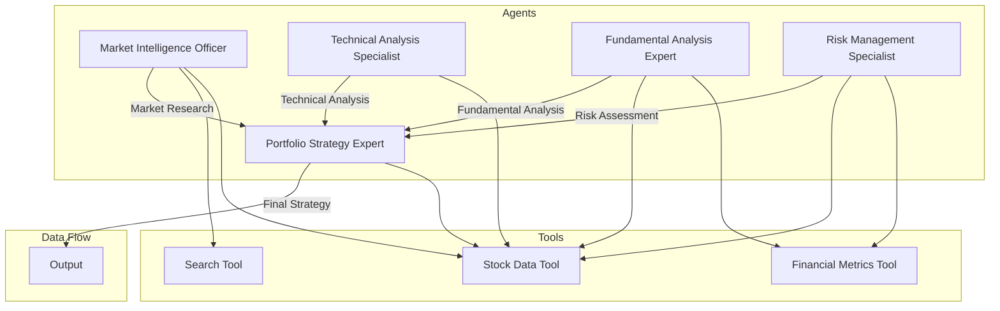

# Agentic Stock Analysis System

This is an exploratory project to get familiar with CrewAI, an orchestration framework for agentic AI. It is built in pure python with a Streamlit frontend. The idea is to provide a free, intelligent stock analysis platform powered by a team of AI agents specializing in different aspects of market analysis. Investing should be accessible to everyone.
(This tool is for informational purposes only. Always conduct your own research and consult with financial advisors before making investment decisions. Feel free to extend this tool to your own needs.)



## Features

### Core Analysis
- **Multi-Agent System**: Five specialized agents working in concert:
  - Market Intelligence Officer: Market research and competitive analysis
  - Technical Analysis Specialist: Price patterns and technical indicators
  - Fundamental Analysis Expert: Financial statements and valuation
  - Risk Management Specialist: Risk assessment and mitigation
  - Portfolio Strategy Expert: Final investment recommendations

### Technical Capabilities
- **Real-time Progress Updates**: Live feedback from agents during analysis
- **Retry Mechanism**: Automatic retry for API calls with exponential backoff
- **Error Handling**: Comprehensive error management across all operations
- **Data Visualization**: Interactive charts and metrics display
- **Responsive Dashboard**: Modern, user-friendly interface

### Analysis Components
- **Market Research**: Industry position, competitive advantages, and market trends
- **Technical Analysis**: Multi-timeframe analysis, support/resistance levels, and indicators
- **Fundamental Analysis**: Financial statements, valuation methods, and growth metrics
- **Risk Assessment**: Volatility analysis, VaR calculations, and stress testing
- **Investment Strategy**: Position sizing, entry/exit points, and portfolio context

### Dashboard Features
- **Interactive Charts**: 
  - Candlestick charts with volume analysis
  - Technical indicators (RSI, MACD)
  - Moving averages
- **Financial Metrics**: 
  - Profitability ratios
  - Valuation metrics
  - Growth indicators
- **Risk Metrics**:
  - Volatility analysis
  - Value at Risk (VaR)
  - Sharpe Ratio
  - Risk level assessment
- **Educational Resources**: 
  - Investment terms glossary
  - Technical analysis explanations
  - Financial metrics definitions

## Installation

1. Clone the repository:
```bash
git clone https://github.com/yourusername/agentic-stock-analysis.git
cd agentic-stock-analysis
```

2. Install dependencies:
```bash
pip install -r requirements.txt
```

3. Set up environment variables:
```bash
cp .env.example .env
# Edit .env with your API keys
```

## Usage

Run the dashboard:
```bash
streamlit run dashboard.py
```

Enter a stock ticker and click "Analyze Stock" to receive:
- Market data visualization
- Technical analysis
- Fundamental analysis
- Investment recommendations

## Project Structure

```
stock-analyst-ai/
├── market_analysis_crew.py  # AI agent implementation
├── dashboard.py            # Streamlit interface
├── requirements.txt       # Dependencies
└── .env                  # Configuration
```

## Dependencies

- crewai (https://docs.crewai.com/introduction)
- streamlit (https://streamlit.io/)
- yfinance (https://pypi.org/project/yfinance/)
- plotly (https://plotly.com/)
- pandas (https://pandas.pydata.org/)
- python-dotenv (https://pypi.org/project/python-dotenv/)

## Contributing

This is a work in progress, and contributions are welcome! Please feel free to submit issues and pull requests.

## License

MIT License

## Disclaimer

This tool is for informational purposes only. Always conduct your own research and consult with financial advisors before making investment decisions. 
